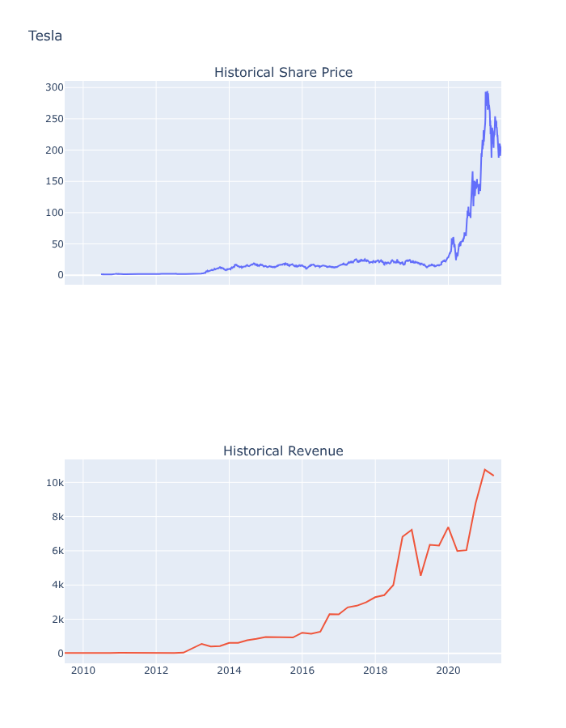
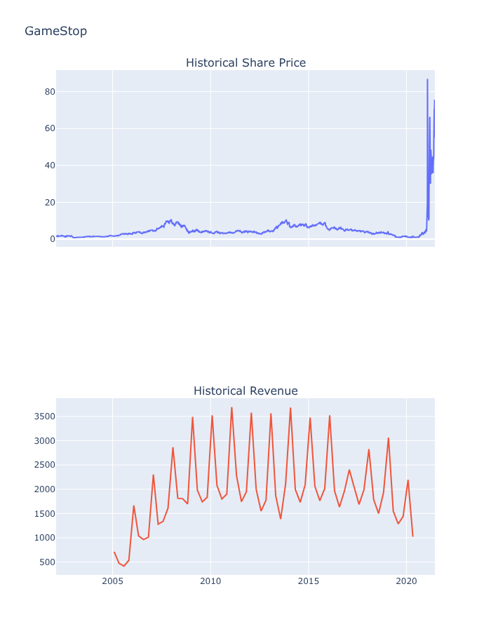

# 📊 Tesla & GameStop Stock and Revenue Analysis
A clean and professional financial analysis using Python, web scraping, and interactive Plotly visualizations.

[](https://colab.research.google.com/github/larybourguignon/tesla-gamestop-ibm/blob/main/Final.ipynb)

### IBM – Python Project for Data Science

This repository contains a complete data analysis project focusing on **Tesla (TSLA)** and **GameStop (GME)**.  
Developed as part of the *IBM Python Project for Data Science* course, the project includes data collection, web scraping, data cleaning, visualization, and financial analysis using Python.

---

## 📁 Repository Structure
```
tesla-gamestop-ibm/
├── Final.ipynb        # Jupyter Notebook with full analysis and visualizations
├── README.md          # Project documentation
└── (additional files if added)
```

---

## 🎯 Project Overview

The main goals of this project are to:

- Collect historical stock data using **yfinance**
- Scrape quarterly revenue data using **BeautifulSoup**
- Clean and prepare financial datasets
- Create interactive visualizations using **Plotly**
- Compare the financial performance of Tesla and GameStop

This project demonstrates essential skills for Python-based data analysis.

---

## 🧰 Tools and Libraries Used

- Python 3
- Pandas  
- NumPy  
- BeautifulSoup (bs4)  
- Requests  
- yfinance  
- Plotly  
- Jupyter Notebook  

---

## 🚀 How to Run the Project

### 1. Clone the repository
```
git clone https://github.com/larybourguignon/tesla-gamestop-ibm.git
cd tesla-gamestop-ibm
```

### 2. Install dependencies
```
pip install pandas numpy yfinance plotly requests beautifulsoup4
```

### 3. Open the notebook

```
jupyter notebook Final.ipynb
```


### 4. Run all cells  
The notebook includes:

- Data extraction
- Web scraping
- Data cleaning
- Interactive charts
- Analysis results

---

## 📦 Requirements
```
pandas
numpy
yfinance
requests
beautifulsoup4
plotly
```

---

## 📈 Visualizations Included

The notebook generates interactive Plotly graphs for:

### Tesla
- Historical stock closing prices  
- Quarterly revenue  

### GameStop  
- Historical stock closing prices  
- Quarterly revenue  

Both charts include zoom and range slider functionality for detailed exploration.

---

## 🛠️ Technical Highlights

### Web Scraping
Quarterly revenue tables were extracted using:

```
requests.get()
BeautifulSoup(html, "html.parser")
```

### Data Cleaning
Revenue values were cleaned with:
```
df["Revenue"] = df["Revenue"].str.replace(',|$', '', regex=True)
```


### Visualization
A reusable function generates the final graphs:

```
make_graph(stock_data, revenue_data, "Tesla")
```


---

## 📊 Key Insights

- Tesla shows **strong and consistent revenue growth**, especially from 2020 onward.  
- GameStop demonstrates **greater revenue instability**.  
- Stock prices reflect major market events:

  - Tesla’s expansion  
  - GameStop’s 2021 short-squeeze  

- Based on fundamentals, **Tesla displays more stable long-term performance**.

---

## ⭐ Highlights (Professional Summary)

- Fully reproducible Jupyter Notebook  
- Real financial data (yfinance + scraping)  
- Interactive Plotly charts  
- Clean revenue preprocessing  
- Clear comparison of Tesla vs GameStop  

---

## 📉 Visual Results

### Tesla — Price vs Revenue
<p align="center">  
    
</p>

### GameStop — Price vs Revenue  
<p align="center">  
    
</p>

---

## 🤝 Contributions
Contributions, suggestions, and improvements are welcome.  
Feel free to open issues or submit pull requests.

---

## 📄 License  
This project is open-source. You may add an MIT License if preferred.

---

**Live Notebook:** [Visualize interativamente](https://larybourguignon.github.io/tesla-gamestop-ibm/)

---

## 👩‍💻 Author

**Larissa Bourguignon**  
Data Science Student  

GitHub: [@larybourguignon](https://github.com/larybourguignon)

---
